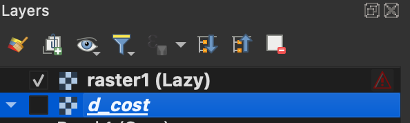
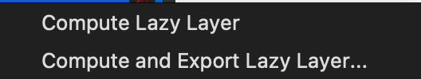

# Raster Tools QGIS Plugin
## About
This QQGIS plugin provides two tools:
1. Lazy Raster Calculator: This raster calculator allows you to perform arithmetic on raster layers with lazy computation. Lazy computation means the result will not be computed until you need it. 
2. Delivered Cost: Calculate timber harvesting and hauling costs using raster-based cost surfaces.

### Features
- Lazy evaluation of rasters
- Raster arithmetic operations
- Raster data type and CRS transformation
- Delivered cost analysis using an area of interest and facility locations
- Export results as new raster layers

## Installation
This plugin requires the folowing python modules: raster_tools, osmnx, and py3dep. The best way to install these into the QGIS environment will depend on your operating system:
### Windows
1. Install QGIS through OSGeo4W Network Installer. You can find the download/instructions at this link: https://qgis.org/download/.
2. Open QGIS and it's python console. In the python console type: 
`import numpy`
`print(numpy.__version__)`
3. Open the OSGeo4W Shell and type the following commands:
`pip install raster_tools osmnx py3dep numpy=={your numpy version in QGIS}`
Replace {your numpy version in QGIS} with whatever you got in step two. For me it was 1.26.4, so mine looked like: `numpy==1.26.4`
4. Download the zip file from this repository. Then in QGIS open the plugins menu from the top and select 'Manage and Install Plugins. Select 'Install from zip' and select the zip file from this repo.

### Linux/Mac
Linux and Mac require QGIS to be installed through the conda-forge channel for this plugin to work. To acess conda-forge you must first install Miniconda by following the instructions at this link: https://www.anaconda.com/docs/getting-started/miniconda/install
1. Once you have Miniconda installed, in your terminal/command prompt enter the following commands:
    - `conda config --add channels conda-forge`
    - `conda config --set channel-priority strict`
    - `conda update --all`
2. If preferred you can create a conda environment for you QGIS to be installed. To do this enter this into your terminal/command prompt:
`conda create --name qgis-env`
You can replace 'qgis-env' with any name you'd like. Next enter:
`conda activate qgis-env'
3. Install QGIS via conda-forge. Enter this command into your terminal/command prompt:
`conda install conda-forge::qgis`
4. To open your newly installed QGIS simply type `qgis` in the conda environemnt you ran the install command from.
5. Install the following dependencies in the conda environment using the following command:
`pip install raster-tools osmnx py3dep`
6. Download the zip file from this repository. Then in QGIS open the plugins menu from the top and select 'Manage and Install Plugins. Select 'Install from zip' and select the zip file from this repo.

## Usage
### Lazy Raster Calculator

#### Expressions
In order to use the calculator widget you must first load one or more rasters into QGIS. These rasters will automatically show up under 'Raster Layers' in the dockwidget, from here you can double click the raster to insert it into the expression box and form the expression you wish to evaluate. If an expression is invalid it will notify you of this below the expression box.

The calculator provides the following operators: 
- Arithmetic operators: addition +, subtraction -, multiplication *, division /, exponents **, and parentheses ( ).
- Logical operators: less than <, greater than >, less than or equal too <=, greater than or equal too >=, not equal too !=, and equal too ==. These will return a raster of boolean values.
- Bitwise operators: and &, or |, not ~. The input rasters must be of type int for these operators.

#### Result Layer Options

##### CRS
As you can see you have a couple of options for the resulting layer from your expression. The first one being the CRS of the resulting layer. You can choose from EPSG:4326 or the project CRS by using the drop down button. You may also select the button to the right of the combo box which will open the QGIS dialogue for CRS selection. Additionally you can type the CRS into the box, but it must be in authid format, for example "EPSG:4326".

##### Data Type
You can choose what data type the resulting raster will be outputted as, or you may let raster_tools handle the data type. 

The following data types are included:

##### Lazy Layer Checkbox

When the lazy layer checkbox is **checked** and the 'Okay' button is clicked with a valid expression you will be prompted for a name for the lazy raster. After entering a name, a placeholder layer will be added to the QGIS layer panel with '(Lazy)' following the name you inputted as shown here: 

You may notice that nothing shows up in the map extent of QGIS or that the new layer has an unavailable layer icon next to it's name, this is because the raster has not been calculated yet. From here you can either force computation or use the lazy layer in another expression. To force computation right-click on the lazy layer and choose one of the options as shown below:

The 'Compute Lazy Layer' option will force computation of the raster and place it into the QGIS layer panel. 'Compute and Export Lazy Layer...' will force computation and then prompt you for a location to save it too, avoiding loading it into QGIS altogether. After you choose one of these options the lazy layer will be removed from the layer panel and you will no longer be able to use it.
If you leave the checkbox **unchecked** then the expression will be evaluated immediately, you will be prompted for a name for the layer, and the resulting layer will be added to the QGIS layer panel. This is only a TEMPORARY layer, meaning that you must export the raster to a location on your computer, otherwise it will be lost once QGIS is closed.

### Delivered Cost Analysis
The Delivered Cost Analysis consists of two tabs: Values and Run.

#### Values tab

The values tab allows you to set values associated with lumber costs. These values will be used in the computation for the resulting rasters.

#### Run tab

##### Background Layers
The background layers are just a way to help visualize your area of interest and are not used in the computation. You can select the following background layers if you wish:
- ESRI World Imagery: aerial imagery of the world
- Burn Probability: the likelihood of a given area burning
- PCL (Potential Control Location): shows where fire containment will be most successful
- Landfire EVT: shows existing vegetation type

#### Polygon for AOI (Area of Interest)
This is the area of interest you wish to get lumber from. You can either draw a polygon or select one that you have added to the QGIS layer panel. If you wish to use your own it must be a vector layer with a polygon feature, or it will not be selectable from the combo box. If you select the 'Draw' button then you can select points on the map with a left-click and finish the polygon with a right-click. Once you right-click this will automatically add a temporary vector layer to the layer panel named 'AOI', display the polygon on the map, and update the combobox to the show the polygon you have just drawn. You can delete the layer from the layer panel or press the 'Draw' button again if you wish to start over.

#### Facility Location(s)
Facility locations are where you wish to deliver the lumber too. You can either pick the points on the map or select a vector layer with point geometries from the layer panel. If you select the 'Pick' you can then left-click on the map extent where the facility would be located. This will add a cross marker where you clicked on the map and a vector layer to the layer panel named "Facilities". To add more than one facility simply press the 'Pick' button again. You can add as many points as you would like. The combo box will also update to show this layer being used for the computation. To start over you can remove the "Facilities" layer from the layer panel.

#### Choose Roads File (Optional)
You may wish to use a vector layer with predefined roads in the computation. To do this upload your roads layer into QGIS and select it from the combo box. The vecctor layer must have a 'highway' field filled with one of the following: motorway, trunk, primary, secondary, tertiary, unclassified, residential. You may also include a 'maxspeed' field that can be used in the computation. If no roads file is used then the data will be pulled from Open Street Maps.

#### Choose Barriers File (Options)
You may also want to use vector layer with predefined barriers. Once again you just need to upload the layer to QGIS. There are no required fields for this vector layer. If you do not choose a layer then the barriers will pulled from Open Street Maps.

#### Create Optional Surfaces
The create optional surfaces checkbox allows for more rasters to be outputted from the computation. If **unchecked** two cost rasters will be outputted: Delivered Cost and Additional Treatment Cost. If **checked** seven rasters will be outputted: Delivered Cost, Additional Treatment Cost, Skidder Cost, Cable Cost, Hand Treatment Cost, Prescribed Fire Cost, and Potential Harvesting System.

#### Run 
When you are ready to run the analysis you may hit the run button. You need atleast an area of interest and one facility point for it to work. The progress bar and text box will provide updates for the analysis and notify you if any errors arise. The outputted rasters are automatically added to the QGIS layer panel. Rasters that exceed values of 1000 are automatically capped and the symbology is changed to red, green, and yellow for display purposes. The outputted rasters are TEMPORARY layers and will need to be exported/saved before closing QGIS. Below is a example of what a Delivered Cost ouput might look like.

