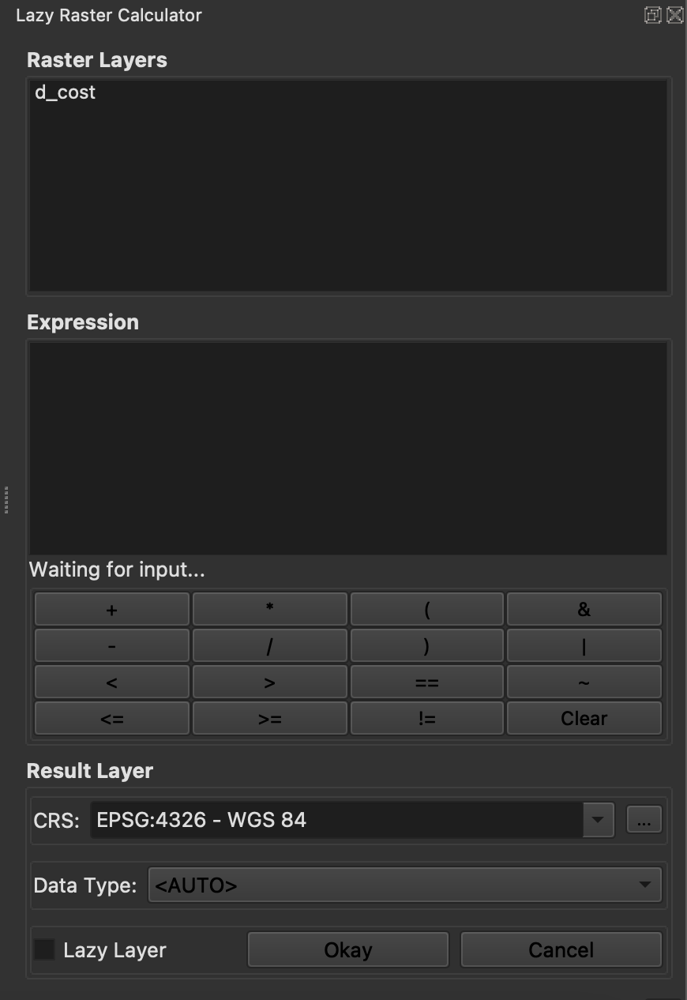
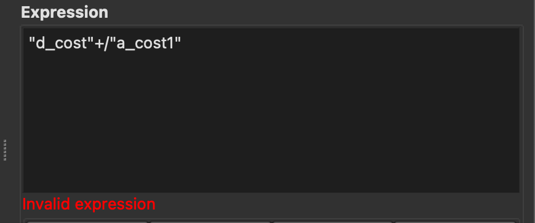
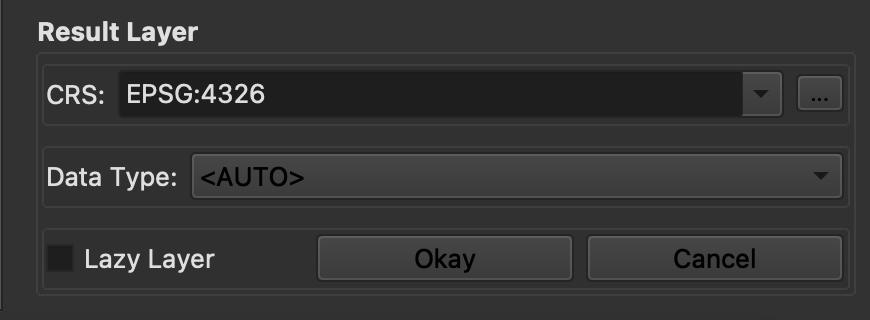
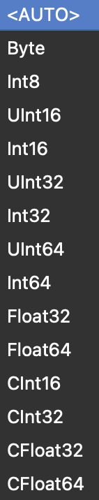
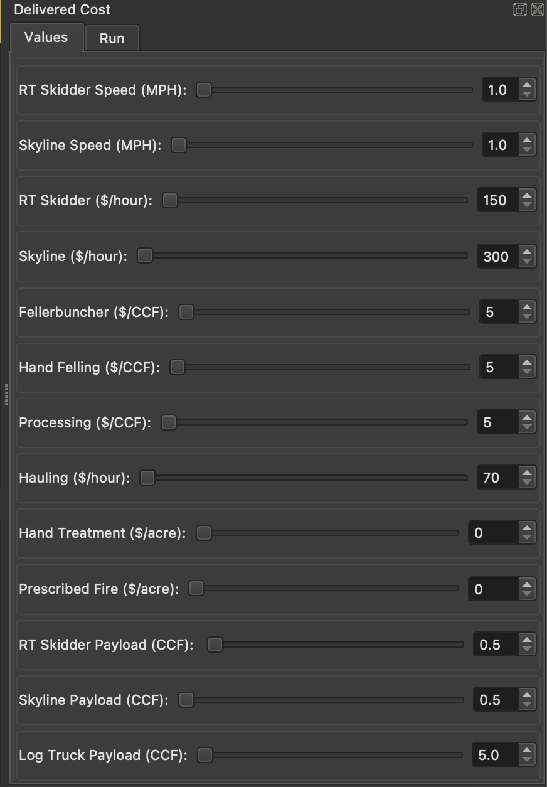
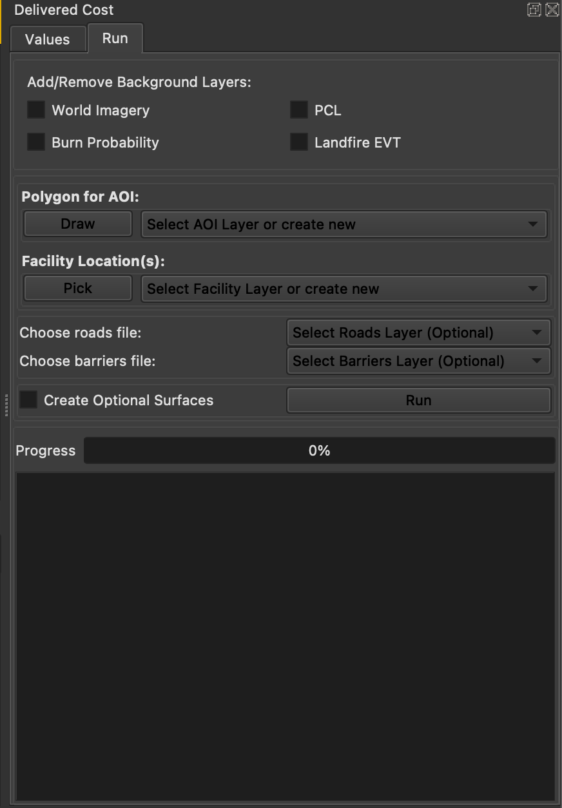
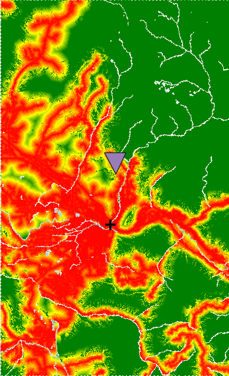

# Raster Tools QGIS Plugin

## About
This QGIS plugin provides two tools:

1. **Lazy Raster Calculator** - This raster calculator allows you to perform arithmetic on raster layers with lazy computation. Lazy computation means the result will not be computed until you need it. 
2. **Delivered Cost** - Calculate timber harvesting and hauling costs using raster-based cost surfaces.

### Features
- Lazy evaluation of rasters
- Raster arithmetic operations
- Raster data type and CRS transformation
- Delivered cost analysis using an area of interest (AOI) and facility locations
- Export results as new raster layers

---

## Quick Start
1. **Install QGIS** (see OS-specific instructions below)
2. **Install Dependencies** (`raster_tools`, `osmnx`, `py3dep`)
3. **Install this plugin** from ZIP via QGIS Plugin Manager
4. **Use**:
    - Lazy Raster Calculator: Load rasters, build expression, run
    - Delivered Cost: Define AOI, facility locations, run analysis

---

## Installation

This plugin requires the following python modules: 
- `raster_tools`
- `osmnx` 
- `py3dep`

The installation method depends on your operating system. `osmnx` and `py3dep` are not required for the Lazy Raster Calculator.

---

### Windows

1. **Install QGIS** using the OSGeo4W Network Installer:
[https://qgis.org/download/](https://qgis.org/download/)

2. **Check QGIS's NumPy version**:
    Open the QGIS Python console and run:
    ```python
    import numpy
    print(numpy.__version__)
    ```

3. **Install dependencies in OSGeo4W Shell**:
    ```bash
    pip install raster_tools osmnx py3dep numpy==<your_numpy_version>
    ```
    Replace `<your_numpy_version>` with version from step 2 (e.g., 1.26.4)

4. **Install the plugin from zip**:
    - Download the ZIP from this repository
    - In QGIS: `Plugins → Manage and Install Plugins → Install from ZIP`
    - Select the downloaded ZIP file

5. **Install the plugin in QGIS**:
    - In QGIS: `Plugins → Manage and Install Plugins → All` 
    - Search `Raster Tools`
    - Select Install

---

### Linux/Mac

*Disclaimer*: The Mac version is experimental and may present bugs in QGIS.

For this plugin to work, QGIS must be installed via the **conda-forge** channel.

1. **Install Miniconda**: 
    Follow the instructions here:
    [https://www.anaconda.com/docs/getting-started/miniconda/install](https://www.anaconda.com/docs/getting-started/miniconda/install)

2. **Enable conda-forge**:
    In your terminal/command prompt:
    ```bash
    conda config --add channels conda-forge
    conda config --set channel-priority strict
    conda update --all
    ```

 3. *(Optional)* Create a dedicated environment:
    ```bash
    conda create --name qgis-env
    conda activate qgis-env
    ```

4. **Install QGIS**:
    ```bash
    conda install conda-forge::qgis
    ```

5. **Install dependencies**: 
    ```bash
    pip install raster_tools osmnx py3dep elevation
    ```

6. **Launch QGIS** from your conda environment:
    ```bash
    qgis
    ```

7. **Install the plugin from zip**:
    - Download the ZIP from this repository
    - In QGIS: `Plugins → Manage and Install Plugins → Install from ZIP`
    - Select the downloaded ZIP file

8. **Install the plugin in QGIS**
    - In QGIS: `Plugins → Manage and Install Plugins → All` 
    - Search `Raster Tools`
    - Select Install

---

## Usage
### Lazy Raster Calculator



#### Expressions
Load one or more rasters into QGIS. They will appear under **Raster Layers** in the dock widget.
Double-click a raster to insert it into the expression box, or type it manually.
If an expression is invalid, an error message will appear below the expression box.



#### Supported operators:

Arithmetic: `+` `-` `*` `/` `**` `()`
Logical: `<` `>` `<=` `>=` `!=` `==` (returns boolean rasters: 0/1)
Bitwise: `&` `|` `~` (input rasters must be integer type)

---

#### Result Layer Options



##### CRS Selection

- Choose EPSG:4326, project CRS, or open CRS dialog
- You can also type a CRS in authid format (e.g., EPSG:4326)

##### Data Type

- Select the output raster's data type, or let `raster-tools` decide



---

##### Lazy Layer Checkbox


When checked:

- You'll be prompted to name the lazy raster
- A placeholder layer (with`(Lazy)` suffix) is added to QGIS
- The raster is not computed until you right-click → **Compute Lazy Layer** or **Compute and Export Lazy Layer**

When unchecked:

- Expression is computed immediately
- result is added as a **temporary raster layer** (must be exported to save)

---

### Delivered Cost Analysis

The Delivered Cost Analysis consists of two tabs: **Values** and **Run**.

#### Values tab



- Set values for lumber cost calculations. These values are used in the raster computation.

---

#### Run tab



##### Background Layers (optional visualization aids):

- ESRI World Imagery
- Burn Probability
- PCL (Potential Control Location)
- Landfire EVT (Existing Vegetation Type)

--- 

#### Polygon for AOI (Area of Interest)

- Draw on map or select existing polygon vector layer
- Must be polygon geometry
- Drawing creates a temporary "AOI" layer and updates the combo box
- To clear layer select `Draw` or delete the "AOI" layer from the panel

#### Facility Location(s)

- Pick points on map or select existing point vector layer
- Picking adds a "Facilities" layer with markers
- Multiple points allowed
- To clear delete layer from layers panel

#### Optional Roads File

- Vector layer with highway field (motorway, trunk, primary, secondary, tertiary, unclassified, residential)
- Optional maxspeed field
- If omitted, OpenStreetMap roads are used

#### Optional Barriers File

- Vector layer with any geometry
- No required fields
- If omitted, barriers from OpenStreetMap are used

#### Create Optional Surfaces

- **Unchecked**: Outputs Delivered Cost + Additional Treatment Cost
- **Checked**: Outputs 7 rasters (Delivered Cost, Additional Treatment Cost, Skidder Cost, Cable Cost, Hand Treatment Cost, Prescribed Fire Cost, Potential Harvesting System)

---

#### Run Analysis

- Requires at least 1 AOI and 1 facility point
- Progress bar shows updates
- Output rasters are **temporary** (must be exported to save)
- Rasters with values >1000 are capped and displayed in red/yellow/green symbology

Example delivered cost output:



---

## License
GPLv3 License - see `LICENSE` for details 

